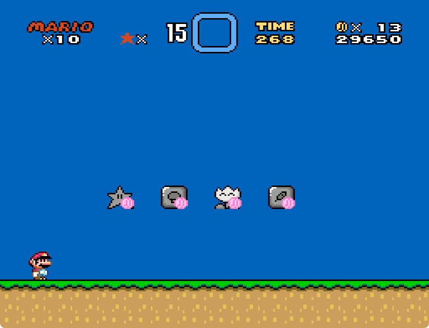

# Shop

Created by zuccha, commissioned by Anas.

Blocks for buying items and powerups, spending bonus stars, coins, lives, and/or
score points.

|  |
| :-------------------------------------------------------------: |
|      Buy items and powerups, each one with different costs      |

## Contents

This package comes with the following files:

- `routines/check_and_pay.asm`: Utility file that contains the function that
  checks if the player has enough funds and uses them.
- `shop_item_from_below.asm`: A block for buying an item to be stored in the
  reserve box by hitting it from below.
- `shop_item_through.asm`: A block for buying an item to be stored in the
  reserve box by going through it.
- `shop_powerup_from_below.asm`: A block for buying a powerup to be assigned to
  the player by hitting it from below.
- `shop_powerup_through.asm`: A block for buying a powerup to be assigned to the
  player by going through it.

Detailed instructions on how blocks work can be found in their respective files.

## Instructions

Copy `routines/check_and_pay.asm` in GPS' "routines" folder.

Copy any number of `shop_item_from_below.asm`, `shop_item_through.asm`,
`shop_powerup_from_below.asm`, and `shop_powerup_through.asm` into your block
folder. You can configure them with the defines specified inside the files. For
every block you're using, add the following in GPS's "list.txt":

```
  200:130 shop_item_from_below.asm
  201:25  shop_item_through.asm
  202:130 shop_powerup_from_below.asm
  203:25  shop_powerup_through.asm
```

Notice that "from_below" blocks should act as 130 (or anything solid) and
"through" should act as 25 (or anything non-solid).

## Advanced Usage

The file `routines/check_and_pay.asm` defines a `check_and_pay` macro that
checks a cost (specified via scratch RAM, for more check the description in the
file) and, if the player can afford it, it subtracts it from the player's
reserve (e.g., if the cost is 1 life and 3 coins, the routine will remove 1 life
and 3 coins from the current player if they have enough of both).

This can be used to create any sort of blocks that require payment, in addition
to those included here that add items to the item box. For instance, you could
spawn sprites, flip the ON/OFF switch, etc.
