# Customize Status Bar

Yet another patch for customizing the status bar.

## Table of Contents

1. [Motivation](#motivation)
   1. [Minimal style](#1-minimal-style)
   2. [Elements' visibility](#2-elements-visibility)
   3. [Level-specific customization](#3-level-specific-customization)
   4. [Conditional visibility](#4-conditional-visibility)
   5. [Dynamic positioning](#5-dynamic-positioning)
   6. [Custom coin limit](#6-custom-coin-limit)
   7. [Disable the item box](#7-disable-the-item-box)
   8. [Custom message for all dragon coins](#7-custom-message-for-all-dragon-coins)
2. [Usage](#usage)
   1. [Folder structure](#folder-structure)
   2. [Compatibility](#compatibility)
   3. [Patching](#patching)
   4. [Global configuration](#global-configuration)
   5. [Level configuration](#level-configuration)
   6. [Custom graphics](#custom-graphics)
   7. [Revert patch](#revert-patch)
3. [Limitations](#limitations)
4. [Hijacks](#hijacks)
5. [Credits](#credits)

## Motivation

So, why make another patch that modifies the status bar?

I wanted a status bar that has the following features:

1. All original features in minimal style.
2. Alter visibility of each element (score, dragon coins, time, lives, coins,
   bonus stars, item box) individually.
3. Allow level-specific customization of each element.
4. Conditional visibility of some elements (e.g., hide time indicator if time
   limit is set to 0).
5. Dynamic positioning of elements (i.e., if one element in one group is not
   visible, the others shift to fill the gap).
6. Custom coin limit.
7. Disabling the item box (or modify its position).
8. Display a custom message when collecting all dragon coins.

Let's cover each aspect individually.

### 1. Minimal style

The patch presents all elements of the original SMW status bar in a more minimal
style.

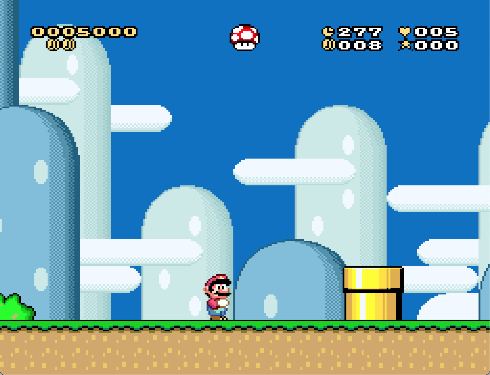

Goodbye nasty graphics that crowd your screen!

**N.B.: The patch comes with a modified GFX28 with (imo) prettier graphics for
some elements. Usage is completely optional.**

### 2. Elements' visibility

This patch allows to control the visibility of the different elements of the
status bar easily via defines. You can disable useless components on the fly

```asm
!ScoreVisibility = 0
```

|  | 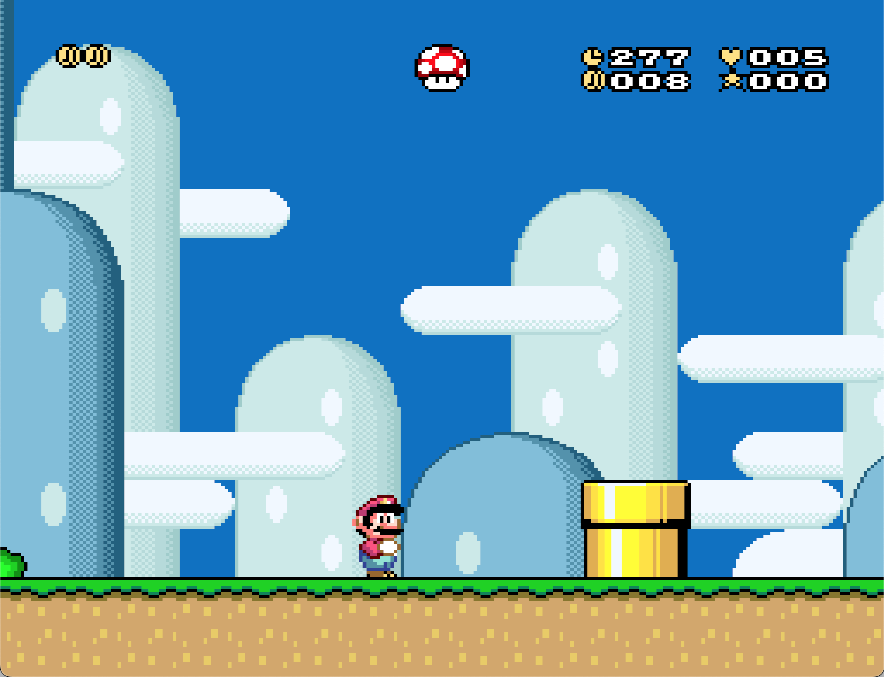 |
| :------------------------------------------: | :----------------------------------------------: |
|                    Before                    |                      After                       |

### 3. Level-specific customization

The patch provides a set of settings that allow to configure the status bar
globally. However, if you feel the need to enable/disable/tweak the behavior of
the sidebar for a specific level, you can just do that!

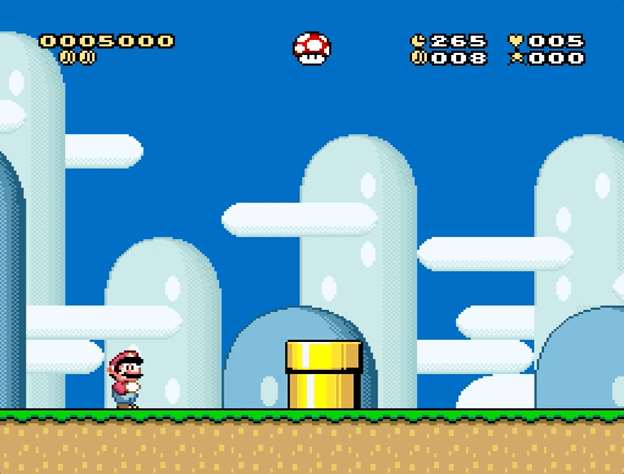

Global configuration is done via the settings you find in
`configuration/global.asm`, while per-level customization is handled through
tables in `configuration/levels.asm`. I suggest you first check out the global
settings (a more detailed explanation on what each setting does is provided
there), and then the levels file.

### 4. Conditional visibility

With a specific global setting flag, you can make some of the elements appear
only when they are relevant. In particular

- Time: The time indicator will appear only in levels where a time limit is set.
- Coins: The coin indicator will appear only if the
  [coin limit](#custom-coin-limit) is greater than zero.

For instance, with

```asm
!TimeVisibility = 2
```

we get

|              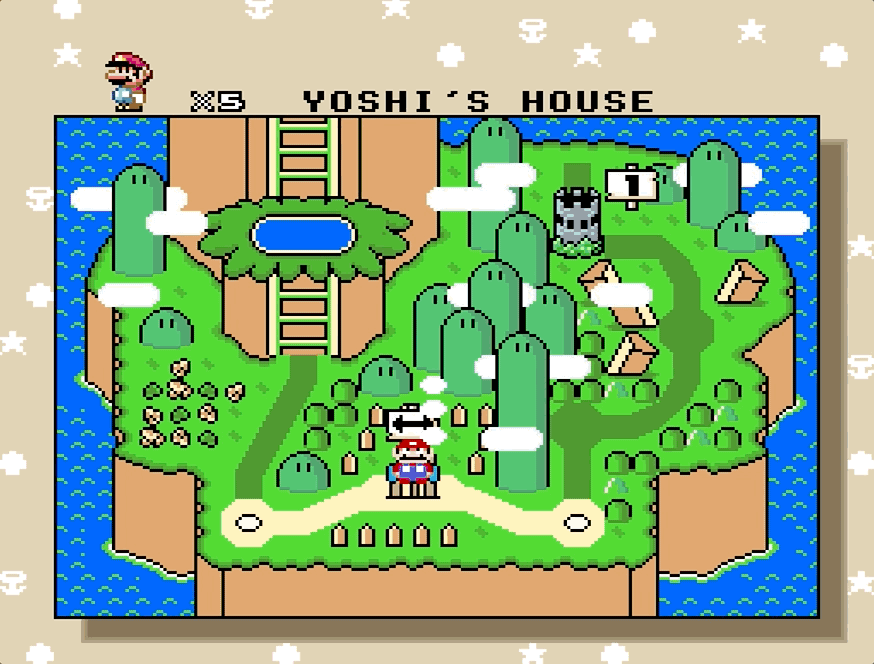               |              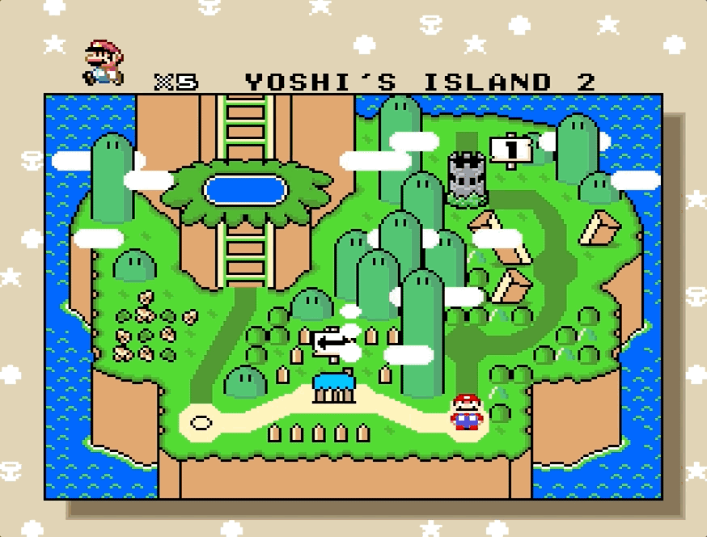               |
| :----------------------------------------------------------------: | :----------------------------------------------------------------: |
| Yoshi's House has no time limit, so no indicator in the status bar | Yoshi's Island 2 has a time limit, visible in the top-right corner |

For these specific cases, you don't even need to customize the settings for
individual levels!

### 5. Dynamic positioning

Status bar elements are organized in clusters:

- Group 1: Bonus Stars, Coins, Lives, and Time
- Group 2: Dragon Coins and Score
- Item Box

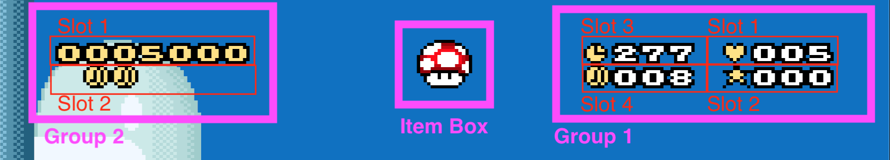

Every group controls its set of elements to display in positions called "slots".
Elements within a group are ordered by priority via settings. For instance

```asm
!Group1Order = !Lives, !BonusStars, !Time, !Coins
```

By default, in group 1 the lives indicator has the highest priority, and the
coins the lowest. But what does this mean?

Visible elements will be positioned in slots in increasing order. In the example
above, the life counter is the first element, so it is drawn in slot 1, bonus
stars are drawn in slot 2, and so on. This is useful because if some element is
not visible, those that follow will shift to take its place, so to avoid holes
in your status bar.

Let's suppose we configured the time indicator to appear only if the time limit
is greater than zero. Then:

| 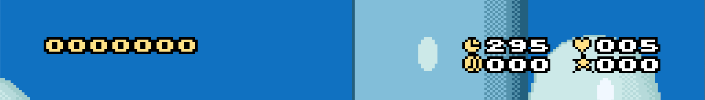     |
| -------------------------------------------------------------- |
| In Yoshi's Island 1 all elements of the status bar are visible |

| 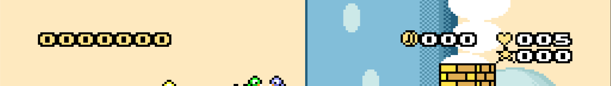                                                                                   |
| ---------------------------------------------------------------------------------------------------------------------------------------------- |
| In Yoshi's House the time limit is zero, so the time doesn't appear and the coin indicator (which has lower priority) shifts to take its place |

The same applies for score and dragon coins. If the score is not visible, dragon
coins will shift to the top line of the status bar. You can check
[this example](#2-elements-visibility).

By default slots for each groups are drawn close to each other, but you can
actually place each slot wherever you want.

### 6. Custom coin limit

It is possible to set a custom coin limit for each level by setting the value in
a table in `configuration/levels.asm`. By default each level has a limit of 100
coins like in vanilla (the 100th will collect a life).

You can also control whether you want the counter to reset and/or add a life
when reaching the limit.

### 7. Disable the item box

Besides making the power up in the item box visible or invisible, it is also
possible to disable the item box entirely

```asm
!PowerUpVisibility = 2
```

With this setting, collecting an additional power up won't store it in the item
box. Power ups cannot be dropped when taking damage or by pressing select.

| 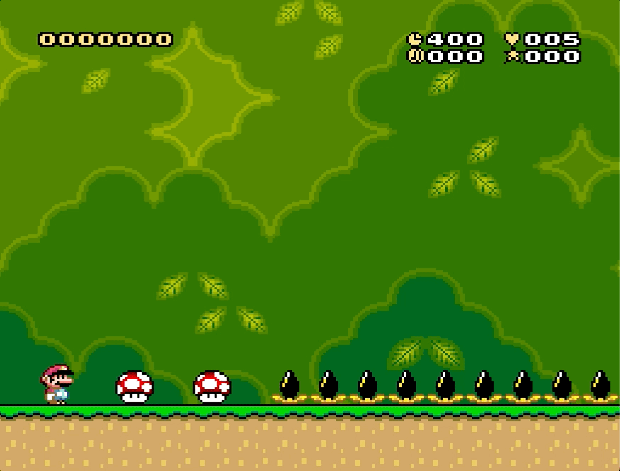 |
| :---------------------------------------------: |
|                Disabled item box                |

It is also possible to change the horizontal position of the item box. The
change will affect both the position of the item box in the status bar and the
position form where the item will fall when taking damage or pressing select.

| 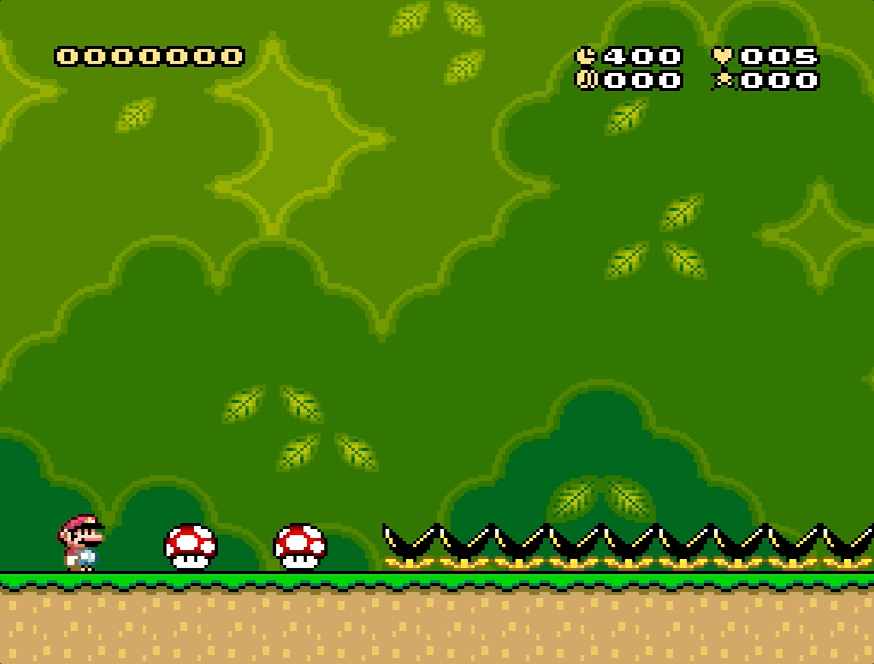 |
| :-------------------------------------------------: |
|                  Shifted item box                   |

8. Custom message for all dragon coins

You can show a custom message to display in the status bar when all dragon coins
are collected (instead of just seeing all five coins)

```asm
!UseCustomDragonCoinsCollectedGraphics = 1
```


You can also customise the message by using the graphic tiles in `GFX28`.

```asm
;                                      D    O    N    E    !
!CustomDragonCoinsCollectedGraphics = $0D, $18, $17, $0e, $28, $FC, $FC
```

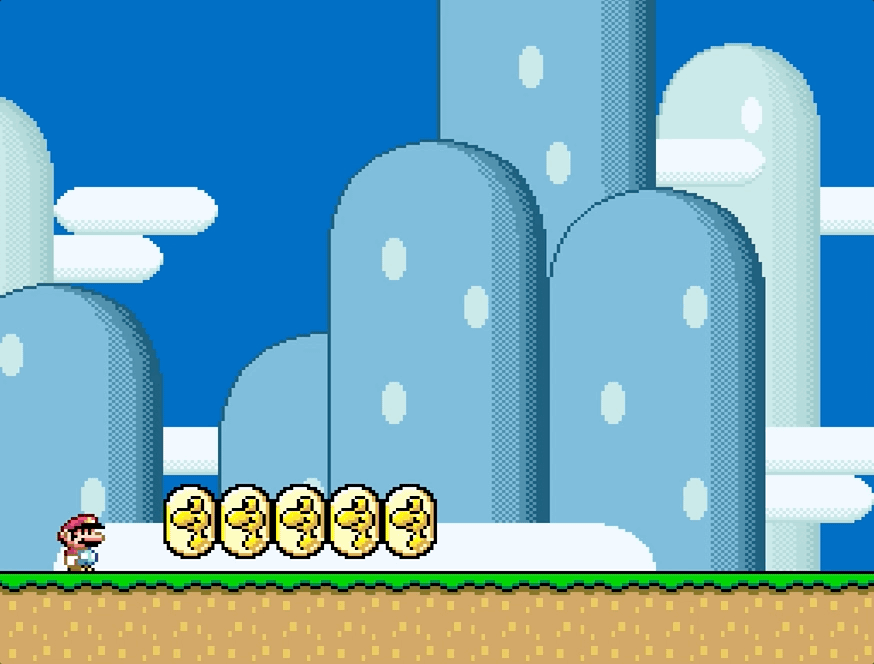

## Usage

In this section you will find the instructions on how to apply, configure, and
restore the patch.

### Folder structure

The patch contains the following files and folders:

- `customize_status_bar.asm`: Main file of the patch. It is the file that needs
  to be given to Asar to apply the patch.
- `customize_status_bar_restore.asm`: Restore file of the patch. It is the file
  that needs to be given to Asar to revert the all changes made by the patch.
- `README.md`: This file.
- `code`: Folder containing generic code for the patch. You probably don't want
  to touch anything in there.
- `configuration/global.asm`: File containing global settings for the status
  bar. You can modify its contents to customize the status bar. It also contains
  detailed explanation on what each setting does.
- `configuration/levels.asm`: File containing settings for specific levels. You
  can modify its contents to customize the status bar. It also contains detailed
  explanation on how level customization works.
- `docs`: Folder containing images and resource for this guide.
- `graphics/GFX28.bin`: Modified version of GFX28. Usage is optional.
- `modules`: Folder containing code for individual elements of the status bar.
  You probably don't want to touch anything in there.

### Compatibility

This patch is compatible with standard SMW hacks. It has not been made SA-1
compatible yet.

### Patching

Run Asar with `customize_status_bar.asm`.

`customize_status_bar.asm` has to be in the same folder as `code`,
`configuration`, and `modules` folders.

### Global configuration

You can configure the behavior of the status bar globally by modifying the
values in `configuration/global.asm`. For every setting there is an extensive
explanation on what it does and what values it accepts.

### Level configuration

You can configure level-specific behaviors that override global settings in
`configuration/levels.asm`.

### Custom graphics

The patch comes with a modified version of `GFX28.bin`, that you can use. The
changes are:

1. Lower the clock tile ($76) by one pixel.
2. Replace the first part of the "TIME" text ($3D) with an empty coin that can
   be used to display missing dragon coins (instead of a blank space).
3. Replace the middle part of the "TIME" text ($3E) with a heart that can be
   used in front of the lives counter.
4. Replace the last part of the "TIME" text ($3F) with a star that can be used
   in front of the bonus stars counter.

**Using the modified version is entirely optional.**

To use the modified version, simply replace the `Graphics/GFX28.bin` file in
your ROM hack folder with `graphics/GFX28.bin` present in this patch.

### Revert patch

To undo the changes applied by the patch, run Asar with
`customize_status_bar_restore.asm`. This file doesn't have any dependencies.

Reverting the patch should restore the vanilla version of the status bar, unless
another patch that modifies it was previously applied (and not reverted).

## Limitations

The current patch suffers from the following limitations:

1. It is not possible to use the left-most tile of the second row of the status
   bar.
2. The color palettes for every tile in the status bar are static and cannot be
   customized dynamically.
3. It is not possible to change dynamically the visibility/order of elements in
   the status bar (e.g., via RAM addresses). This might be implemented in the
   future.

## Hijacks

The patch hijacks the original code in three points:

1. `$008E6F-$008E73` (5 bytes): Inject the custom status bar routine in the old
   status bar code.
2. `$028008` (1 byte): Prevent item in item box from falling. Check our
   [this](https://www.smwcentral.net/?p=memorymap&game=smw&region=rom&address=028008&context=).
3. `$028052` (1 byte): Override item box horizontal position. Check our
   [this](https://www.smwcentral.net/?p=memorymap&game=smw&region=rom&address=028008&context=).

## Credits

This patch was developed by zuccha, based on
[HammerBrother's tutorial](https://www.smwcentral.net/?p=section&a=details&id=26018)
on the sidebar.

Credits are optional.
