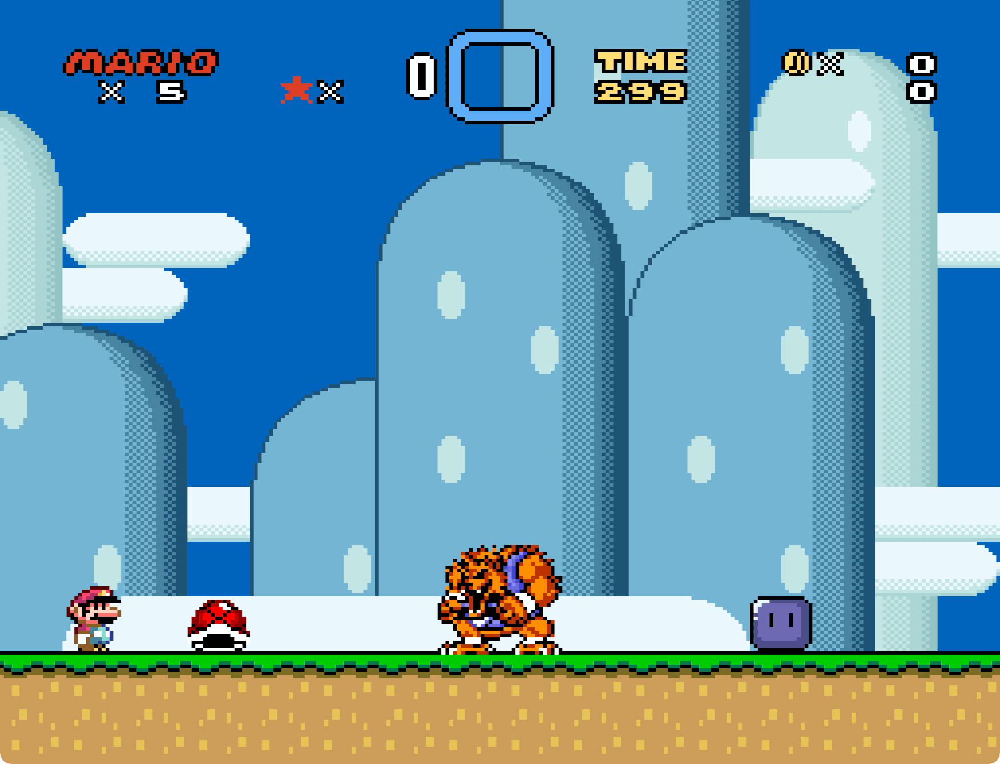

# GIRIAN / WOO

Authors: Code by zuccha, graphics ripped by Blizzard Buffalo, requested by
Blizzard Buffalo.

Girian/Woo enemy from Super Ghouls N' Ghosts. This sprite can follow the player
and spit fire/ice.



## Contents

This package contains the following files:

- `README.txt`: This file.
- `ExGraphics/ExGFX80.bin`: The graphics file containing the images for the
  Girian/Woo, the fire, and the ice projectiles.
- `Palettes/woo.pal`: Palette containing the colors for the Woo.
- `Palettes/woo.palmask`: Mask for the Woo palette.
- `PIXI/list.txt`: A list for PIXI setting the Girian/Woo and the fire/ice
  projectiles as numbers 00 and 10 respectively. Feel free to use this file if
  you don't have any other custom sprites already inserted in the hack.
- `PIXI/sprites/girian.asm`: Code for the Girian/Woo.
- `PIXI/sprites/girian.json`: Configuration for the Girian/Woo.
- `PIXI/cluster/girian_fire.asm`: Code for the fire/ice spit by the Girian/Woo.

## Usage

Here follow the instructions on how to use and customize this sprite.

### Simple insertion

If you want to insert the sprite with the provided `list.txt` and graphics file,
do the following:

1. Copy `PIXI/list.txt` in PIXI's main folder.
2. Copy `PIXI/sprites/girian.asm` and `PIXI/sprites/girian.json` in PIXI's
   `sprites` folder.
3. Copy `PIXI/cluster/girian_fire.asm` in PIXI's `cluster` folder.
4. Copy `ExGraphics/ExGFX80.bin` in the ROM's `ExGraphics` folder, then insert
   graphics via Lunar Magic. You can change "80" into any free ExGFX number.
5. Open "Super GFX Bypass" menu in Lunar Magic and change "SP3" to "80" (or the
   number of your choice).
6. In Lunar Magic, open the "Palette Editor" and import `Palettes/woo.pal`.
7. Run PIXI.
8. Insert the sprite in Lunar Magic with the _Insert Manual..._ command. The
   sprite accepts one extra byte and the extra bit; their behavior is described
   in detail in `PIXI/sprites/girian.asm`.

N.B.: You can heavily customize the behavior of the sprite. For more, check
`girian.asm` and `girian_fire.asm`, where all customizable settings have been
documented.

### Customize Sprite Numbers

If you change the number for `girian_fire.asm` in PIXI's `list.txt` (anything
other than the default "10"), you also have to change the `!fire_sprite` define
in `girian.asm` to match that number.

For instance, if you modify `list.txt` as follows

```
12 girian.json

CLUSTER:
2F girian_fire.asm
```

then you have to open `girian.asm` and set `!fire_sprite = $2F`.

### Customize Graphics

By default, the sprite is configured for SP3.

If you want to switch to another SP slot, open `girian.asm` and change the
`!gfx_page` and `!gfx_offset` settings (check their description to set the
correct SP slot).

In `girian.asm` and `girian_fire.asm` there are also settings and tables for
defining which graphic tiles make up the sprite, and configuring different
graphics for different behaviors of the Girian/Woo (idle, walking, etc.).

2.4 Customize Palette

By default the sprite is configured to use sprite palette 3 for the Girian and
sprite palette 7 for the Woo. Vanilla palette 3 already has the correct colors
for the Girian, whereas the colors for the Woo need to be added manually (e.g.,
with the included palette file).

You can change which palettes are used in the ASM files.

### Known Issues

When walking on slopes, the Girian/Woo can fall through vertically sometimes.
Don't put it on a slope I guess ¯\\\_(ツ)\_/¯

## Changelog

### v1.0.0 (2023-10-10)

#### Added:

- Create Girian/Woo.
- Allow to switch between Girian and Woo via extra bit.
- Allow to switch between static/walking via extra byte.
- Allow to switch between spitting/non-spitting via extra byte.
- Allow to configure walking speed.
- Allow to configure max health.
- Allow to configure damage dealt by player (head bounce), thrown sprites, Yoshi
  fireballs, and Mario fireballs.
- Allow to configure how close the player needs to be for the Girian/Woo to
  start spitting fire/ice.
- Allow frequency at which the sprite spits projectiles.
- Allow to configure mouth position (origin for the projectiles).
- Allow to configure speed of the projectile.
- Allow to configure head hitbox of the Girian/Woo (for determining if player is
  bouncing on its head).
- Allow to configure player's vertical speed when it bounces off the sprite's
  head.
- Allow to configure the sound effect played when the Girian/Woo is being hurt.
- Allow to configure the sound effect played when the Girian/Woo dies.
- Allow to configure the sound effect played when the Girian/Woo spits fire/ice.
- Allow to configure the score points rewarded when the Girian/Woo dies.
- Allow to configure the duration of each phase of the Girian/Woo and fire/ice
  projectile.
- Allow to configure the color palettes for the Girian, Woo, fire, and ice.
- Allow to configure the color graphics for the Girian, Woo, fire, and ice,
  during each of their phases.
- Allow to configure the hitbox of the projectile during each of its phases.
- Allow to configure the projectile effect when hitting the player, depending on
  its type (fire/ice). The effects can be: hurt, kill, or stun player.
- Allow to configure the duration of the stun when the player gets hit.
- Allow to configure the sound effect played when the player gets stun.

#### Documentation:

- Add readme
