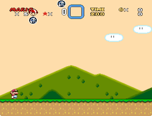

# Gunstar Heroes Bomb

Author: zuccha, requested by TheXander. Palette and graphics provided by
TheXander.

Bomb sprite that explodes in a big blast. The bomb can be set to explode due to
different triggers (timer, ground contact, player contact, etc.).



## Contents

This package contains the following files:

- `README.txt`: This file.
- `ExGraphics/ExGFX80.bin`: The graphics file containing the images for the bomb
  and the explosions.
- `Palettes/gunstar_heroes_bomb.pal`: Palette containing the colors for the
  included `ExGFX80.bin`. In particular, it uses palettes B and C.
- `PIXI/list.txt`: A list for PIXI setting the bomb and the blast sprites to
  numbers 00 and 10 respectively. Feel free to use this file if you don't have
  any other custom sprites already inserted in the hack.
- `PIXI/sprites/gunstar_heroes_bomb.asm`: Code for the bomb sprite.
- `PIXI/sprites/gunstar_heroes_bomb.json`: Configuration for the bomb sprite.
- `PIXI/cluster/gunstar_heroes_bomb_blast.asm`: Code for the blast sprite.

## Usage

Here follow the instructions on how to use and customize this sprite.

### Simple insertion

If you want to insert the sprite with the provided `list.txt` and graphics file,
do the following:

1. Copy `PIXI/list.txt` in PIXI's main folder.
2. Copy `PIXI/sprites/gunstar_heroes_bomb.asm` and
   `PIXI/sprites/gunstar_heroes_bomb.json` in PIXI's `sprites` folder.
3. Copy `PIXI/cluster/gunstar_heroes_bomb_blast.asm` in PIXI's `cluster` folder.
4. Copy `ExGraphics/ExGFX80.bin` in the ROM's `ExGraphics` folder, then insert
   graphics via Lunar Magic. You can change "80" into any free ExGFX number.
5. Open "Super GFX Bypass" menu in Lunar Magic and change "SP4" to "80" (or the
   number of your choice).
6. In Lunar Magic, open the "Palette Editor" and import
   `Palettes/gunstar_heroes_bomb.pal`.
7. Run PIXI.
8. Insert the sprite in Lunar Magic with the _Insert Manual..._ command. The
   sprite accepts four extra bytes and the extra bit; their behavior is
   described in detail in `PIXI/sprites/gunstar_heroes_bomb.asm`.

N.B.: You can heavily customize the behaviour of the sprite. For more, check
`gunstar_heroes_bomb.asm` and `gunstar_heroes_bomb_blast.asm`, where all
customizable settings have been documented.

### Customize Sprite Numbers

If you change the number for `gunstar_heroes_bomb_blast.asm` in PIXI's
`list.txt` (anything other than the default "10"), you also have to change the
`!blast_sprite` define in `gunstar_heroes_bomb.asm` to match that number.

For instance, if you modify `list.txt` as follows

```
12 gunstar_heroes_bomb.json

CLUSTER:
2F gunstar_heroes_bomb_blast.asm
```

then you have to open `gunstar_heroes_bomb.asm` and set `!blast_sprite = $2F`.

### Customize Graphics

By default, the sprite is configured for SP4.

If you want to switch to SP1 or SP2, open `gunstar_heroes_bomb.json` and uncheck
the _Use seconds graphics page_ property.

If you want to change to SP1 or SP3, you can modify `!gfx_offset` defined both
in `gunstar_heroes_bomb.asm` and `gunstar_heroes_bomb_blast.asm`.

You can also change all the graphic tiles used by the sprite. To change the
bombs and parachute graphics, check `gunstar_heroes_bomb.asm`. To change the
explosion graphics, check `gunstar_heroes_bomb_blast.asm`.

### Customize Palette

By default the sprite uses sprite palette 4 (global palette C) both for the bomb
and the blasts. It also uses palette 3 (global palette B) when the bomb is
blinking due to the timer going off.

To change the basic palette, you can open the JSON configuration files and
change the _Palette_ property (`0-7`).

To change the blinking animation palette, you can edit `!bomb_alternate_palette`
in `gunstar_heroes_bomb.asm`.

### Spawning Bombs in Another Sprite

If you want to spawn the bomb from another sprite, you can do so by setting its
extra bytes via code:

```
LDA #$00                             ; Bomb sprite number
STZ $00 : STZ $01                    ; Zero speed
STZ $02 : STZ $03                    ; Zero offset
SEC                                  ; Custom sprite
%SpawnSprite()                       ; PIXI's routine

LDA !extra_bits,y : AND #%11111011
STA !extra_bits,y                    ; Use normal bomb graphics
LDA #%00011110 : STA !extra_byte_1,y ; Explode on contact with everything
LDA #$30 : STA !extra_byte_3,y       ; Initial X speed
LDA #$C0 : STA !extra_byte_4,y       ; Initial Y speed
```

Another example

```
LDA #$00                             ; Bomb sprite number
STZ $00 : STZ $01                    ; Zero speed
STZ $02 : STZ $03                    ; Zero offset
SEC                                  ; Custom sprite
%SpawnSprite()                       ; PIXI's routine

LDA !extra_bits,y : ORA #%00000100
STA !extra_bits,y                    ; Use alternate bomb graphics
LDA #%00100001 : STA !extra_byte_1,y ; Parachute, timer
LDA #$F0 : STA !extra_byte_2,y       ; Explode after about 4 seconds
LDA #$00 : STA !extra_byte_3,y       ; No initial X speed
LDA #$00 : STA !extra_byte_4,y       ; No initial Y speed
```
