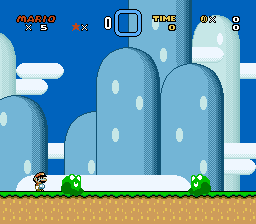

# Mosa Lina - Frog

Author: zuccha, requested by Theopold. Graphics provided by Theopold.

; Frog from the Mona Lisa game. The frog is a jumping sprite that can jump back
; and forth or in one direction. Mario can ride the frog like a platform.

## Contents

This package contains the following files:

- `README.txt`: This file.
- `ExGraphics/ExGFX80.bin`: The file containing the graphics for the frog and
  for Yoshi (to ensure compatibility).
- `PIXI/list.txt`: PIXI list file for quick drag-and-drop setup.
- `PIXI/sprites/mosa_lina-frog.asm`: Code for the frog sprite.
- `PIXI/sprites/mosa_lina-frog.json`: Configuration for the frog sprite.

## Insertion

To insert the sprite, do the following:

1. Copy `PIXI/list.txt` in PIXI's main folder.
2. Copy `PIXI/sprites/mosa_lina-frog.asm` and `PIXI/sprites/mosa_lina-frog.json`
   in PIXI's `sprites` folder.
3. Copy `ExGraphics/ExGFX80.bin` in the ROM's `ExGraphics` folder, then insert
   graphics via Lunar Magic. You can change "80" into any free ExGFX number.
4. Open "Super GFX Bypass" menu in Lunar Magic and change "SP3" to "80" (or the
   number of your choice).
5. Run PIXI.
6. Insert the sprite in Lunar Magic, a few presets are available. Customization
   options are described in detail in `PIXI/sprites/mosa_lina-frog.asm`.

For instance, if you modify `list.txt` as follows

## Compatibility

The sprite is compatible with PIXI 1.42.
