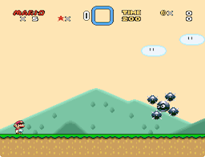

# ORBINAUT

Author: zuccha, requested by NopeContest. The code for orbital movement is based
on GreenHammerBro and Akaginite routines.

Sprite featuring a central orbinaut, with four spike balls orbiting around it.



## Contents

This package contains the following files:

- `README.txt`: This file.
- `ExGraphics/ExGFX80.bin`: The graphics file containing the images for the
  orbinaut and the spike ball. This is a copy of `GFX02.bin`, adding the new
  graphics in empty tiles.
- `PIXI/list.txt`: A list for PIXI setting orbinat and spike ball sprites to
  numbers 00 and 01 respectively. Feel free to use this file if you don't have
  any other custom sprites already inserted in the hack.
- `PIXI/sprites/orbinaut.asm`: Code for the orbinaut sprite.
- `PIXI/sprites/orbinaut.json`: Configuration for the orbinaut sprite.
- `PIXI/sprites/orbinaut_spike_ball.asm`: Code for the spike ball sprite.
- `PIXI/sprites/orbinaut_spike_ball.json`: Configuration for the spike ball
  sprite.

## Usage

Here follow the instructions on how to use and customize this sprite.

### Simple insertion

If you want to insert the sprite with the provided "list.txt" and graphics file,
do the following:

1. Copy `PIXI/list.txt` in PIXI's main folder.
2. Copy `PIXI/sprites/orbinaut.asm`, `PIXI/sprites/orbinaut.json`,
   `PIXI/sprites/orbinaut_spike_ball.asm`, and
   `PIXI/sprites/orbinaut_spike_ball.json` in PIXI's `sprites` folder.
3. Copy `ExGraphics/ExGFX80.bin` in the ROM's `ExGraphics` folder, then insert
   graphics via Lunar Magic. You can change "80" into any free ExGFX number.
4. Open "Super GFX Bypass" menu in Lunar Magic and change "SP4" to "80" (or the
   number of your choice).
5. Run PIXI.
6. Insert the sprite in Lunar Magic with the "Insert Manual..." command. The
   sprite accepts four extra bytes and the extra bit; their behavior is
   described in detail in `PIXI/sprites/orbinaut.asm`.

### Customize Sprite Numbers

If you change the number for `orbinaut_spike_ball.json` in PIXI's `list.txt`
(anything other than the default "01"), you also have to change the "Extra
Property Byte 2" in `orbinaut.json` to match that number.

For instance, if you modify "list.txt" as follows

```
12 orbinaut.json
2F orbinaut_spike_ball.json
```

then you have to open `orbinaut.json` (either with a text editor or with PIXI's
CFG Editor) and set _Extra Property Byte 2_ to `2F`.

### Customize Graphics

If you want to change the position of graphics for the orbinaut and spike ball
in the graphics file and/or use a different graphic slot, you can do so by
modifying their JSON configuration files.

If you want to use SP1 or SP2, set the property _Use second graphics page_ to
`false`. If you want to use SP3 or SP4 set _Use second graphics page_ to `true`.

With _Extra Property Byte 1_ you can define what tile to use. In a graphics file
tiles range from `0x00` to `0x7F`. If you put the graphics file in slots SP1 or
SP3, you use the tile value of the graphics file (`0x00`-`0x7F`). If you put the
graphics file in SP2 or SP4, you need to add `0x80` to the tile value, resulting
in values ranging from `0x80` to `0xFF`.

You can check the following table for reference, where columns indicate whether
_Use second graphics page_ is `false` (1st) or `true` (2nd), and the rows state
the range values for _Extra Property Byte 1_:

|                   | 1st | 2nd |
| ----------------- | --- | --- |
| **`0x00`-`0x7F`** | SP1 | SP3 |
| **`0x80`-`0xFF`** | SP2 | SP4 |

By default, both the orbinaut and the spike ball are in the same graphics file
`ExGFX80.bin` at positions `0x40` and `0x60` respectively. In both their JSON
config file "Use second graphics page" is set to `true` and they are specifying
values greater than `0x80` in _Extra Property Byte 1_ (_i.e._,
`0xC0 = 0x40 + 0x80` and `0xE0 = 0x60 + 0x80`), meaning we need to load `80` in
SP4 via Lunar Magic.

Let's take another example. In Lunar Magic, we set the following SP slots:

- **SP1**: 0
- **SP2**: 2
- **SP3**: 80
- **SP4**: A2

Also, we have `orbinaut.json` with the following properties:

- **Extra Property Byte 1**: `146` (`0x92`)
- **Use second graphics page**: `false`

and `orbinaut_spike_ball.json`:

- **Extra Property Byte 1**: `36` (`0x24`)
- **Use second graphics page**: `true`

For the orbinaut the game will take tile `0x12` in GFX02.bin (SP2), because we
set _Use second graphics page_ to `false` (either SP1 or SP2) and _Extra
Property Byte 1_ is `0x92` >= `0x80` (so SP2). For the spike ball the game will
take tile `0x24` in `ExGFX80.bin` (SP3), because we set _Use second graphics
page_ to `true` (either SP3 or SP4) and its _Extra Property Byte 1_ is `0x24` <
`0x80` (so SP3).

### Customize Palette

By default the sprite uses sprite palette 7 (global palette F) both for the
orbinaut and the spike ball.

To change the palettes, you can open the JSON configuration files and change the
_Palette_ property (`0-7`).

## Compatibility

This sprite is compatible with PIXI 1.40, older versions will not work.

The sprite is compatible with SA-1.

The sprite takes 5 sprite slots, 1 for the orbinaut and 4 for the spike balls,
so be mindful when using it!

## Changelog

### v1.0.0 (2023-08-15)

#### Added:

- Create orbinaut sprite and orbiting spike ball sprite.
- Add modified GFX02.bin as ExGFX80.bin containing orbinaut and spike ball
  graphics.
- Implement four spike ball orbiting the orbinaut.
- Allow to configure orbinaut and spike balls graphics tile and SP slots through
  extra property bytes.
- Allow to configure whether the orbinaut goes through solid walls or not via
  extra bit.
- Allow to configure orbinaut movement (never move, always move, move when
  player move, move when player doesn't move, always go left, always go right)
  via extra byte 1.
- Allow to configure orbinaut horizontal speed via extra byte 2.
- Allow to configure throw range via extra byte 3.
- Allow to configure throw speed via extra byte 4.
- Allow to configure rotation speed via define.

#### Documentation:

- Added readme.
