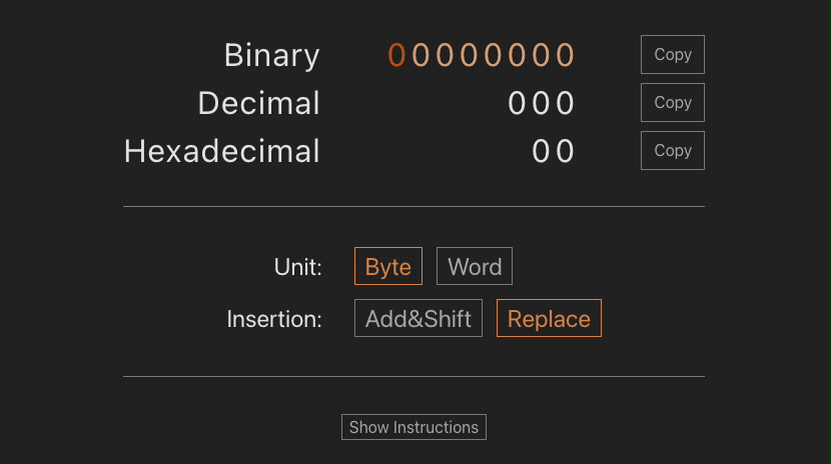

# Byte Converter

Tool for converting values from and to binary, decimal, and hexadecimal.



## Run locally

First, you need to install [Node](https://nodejs.org/en) and [NPM](https://www.npmjs.com/).

To run locally, you need to run

```bash
npm run dev
```

To compile to a single HTML file, run

```bash
npm run build
```

You will find "index.html" in the "dist" folder.
