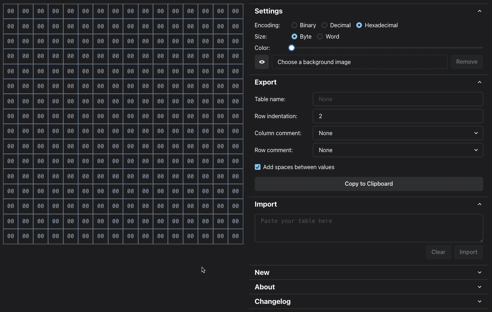

# Byte Table Editor

This is an editor for editing ASM tables.



## Run locally

First, you need to install [Node](https://nodejs.org/en) and [NPM](https://www.npmjs.com/).

To run locally, you need to run

```bash
npm run dev
```

To compile to a single HTML file, run

```bash
npm run build
```

You will find "index.html" in the "dist" folder.

## Changelog

### v1.1.0 (2024-01-01)

#### Changed:

- Improve performance.

#### Fixed:

- Fix rectangle selection.

### v1.0.0 (2023-12-30)

#### Added:

- Add grid for editing ASM tables.
- Allow to create a new table from scratch, by setting width, height,
  and size (byte or word).
- Allow to import a table by pasting an existing one.
- Allow to export the table by copying it to the clipboard, with
  possibility to customize name, indentation, spaces, and adding labels
  to columns and rows.
- Allow to switch between binary, decimal, and hexadecimal encodings.
- Allow to switch between bytes and words.
- Assign background colors to different values and allow to set their
  opacity.
- Allow to set a background image and to toggle its visibility.
- Allow to select multiple cells via mouse drag, with multi selection.
- Allow to select cells with the same value via double click.
