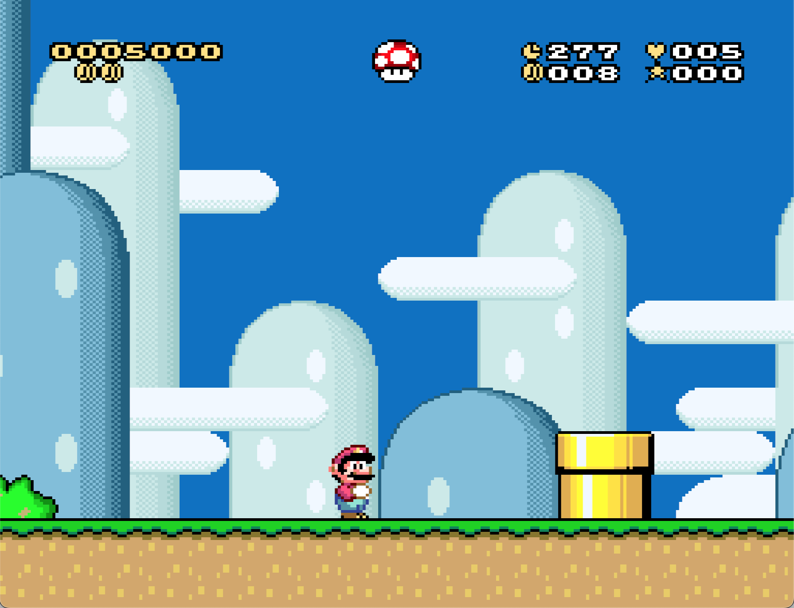
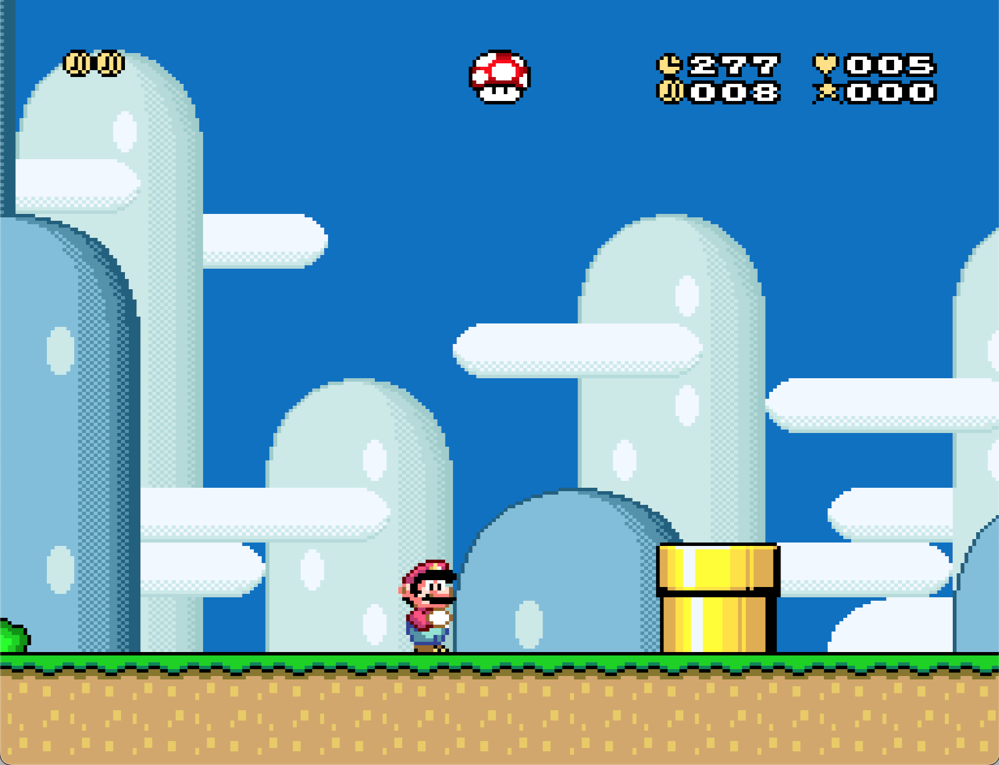
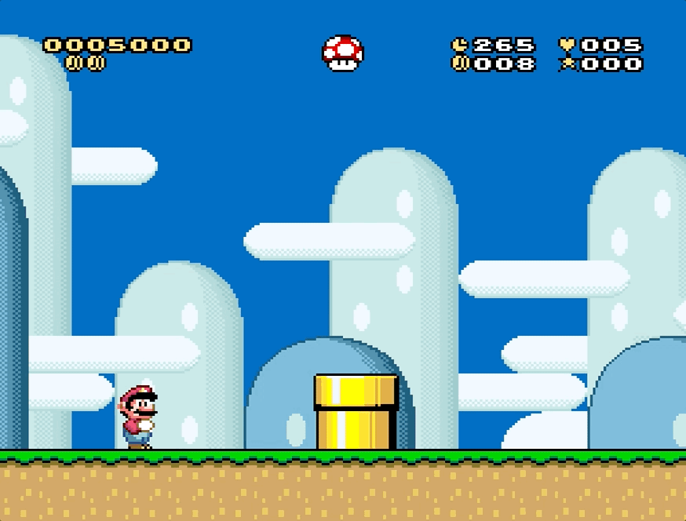
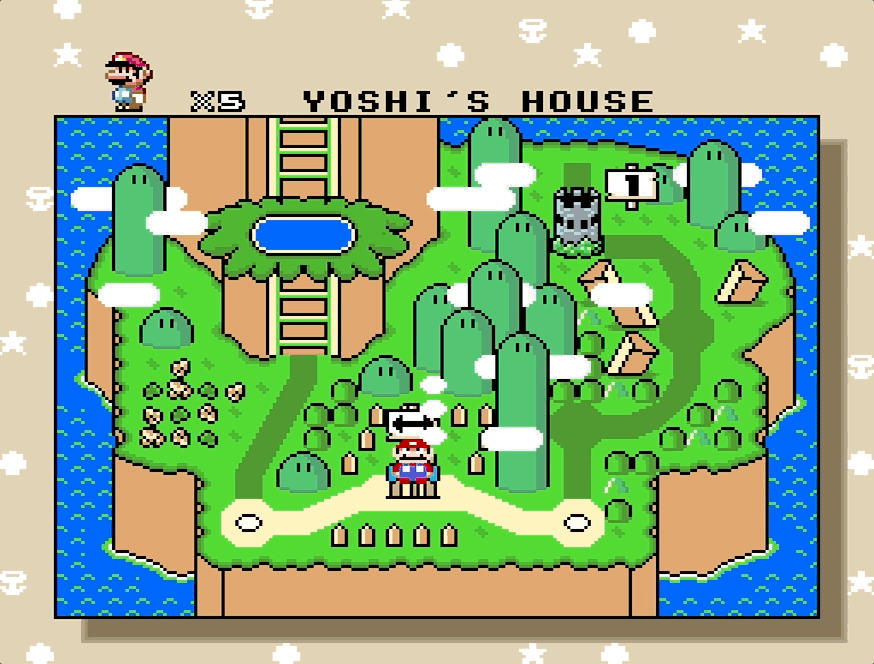
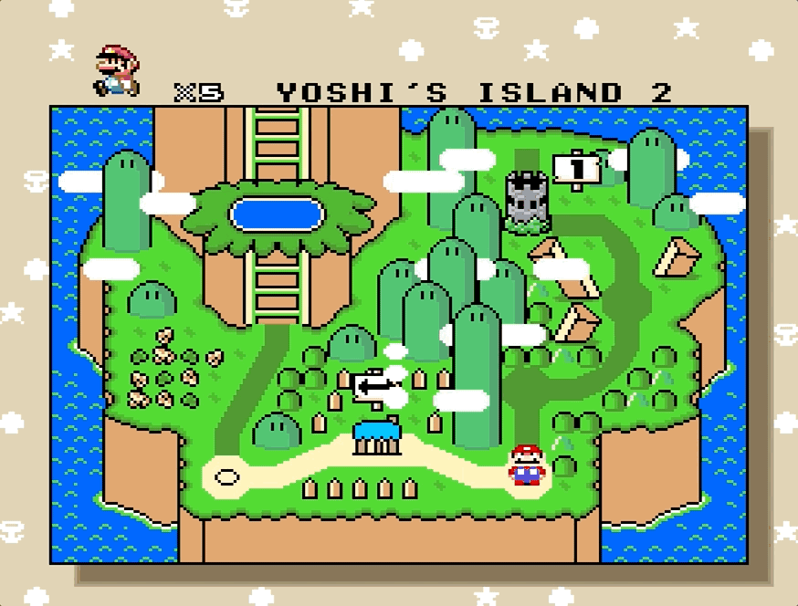
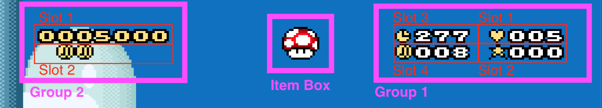
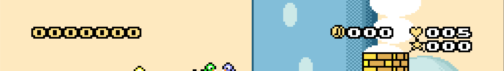
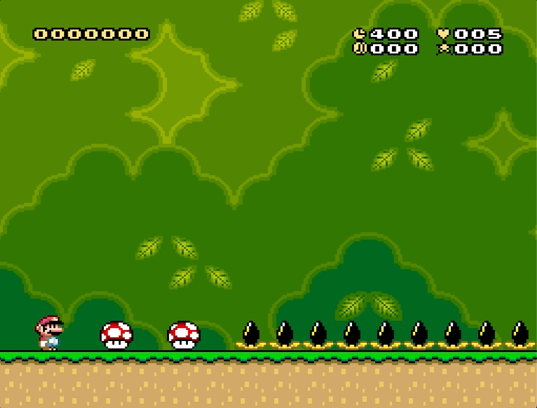
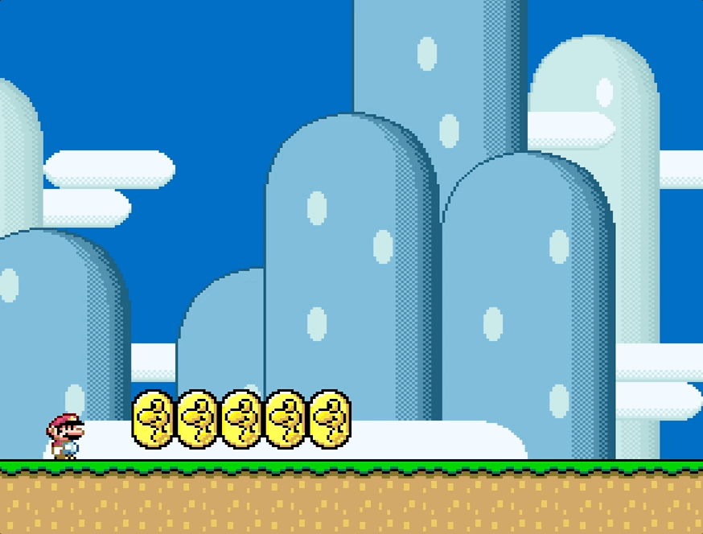

# Custom Status Bar

Welcome to Custom Status Bar (CSB), your UberASM code for customizing the status
bar.

## Table of Contents

1. [Motivation](#motivation)
   1. [Minimalistic style](#1-minimalistic-style)
   2. [Configurable elements' visibility](#2-configurable-elements-visibility)
   3. [RAM-controlled settings](#3-ram-controlled-settings)
   4. [Level-specific customization](#4-per-level-customization)
   5. [Conditional visibility](#5-conditional-visibility)
   6. [Dynamic positioning](#6-dynamic-positioning)
   7. [Disable IRQ and free layer 3](#7-disable-irq-and-free-layer-3)
   8. [UberASMTool](#8-uberasmtool)
   9. [Extra](#9-extra)
2. [Compatibility](#compatibility)
   1. [Hijacks](#hijacks)
   2. [Free RAM](#free-ram)
   3. [KevinM's Retry System](#kevinms-retry-system)
   4. [SA-1](#sa-1)
   5. [Other patches](#other-patches)
3. [Instructions](#instructions)
   1. [Folder structure](#folder-structure)
   2. [How to insert](#how-to-insert)
   3. [Global configuration](#global-configuration)
   4. [Level configuration](#level-configuration)
   5. [Custom graphics](#custom-graphics)
   6. [Access RAM in other programs](#access-ram-in-other-programs)
   7. [How to remove](#how-to-remove)
4. [Limitations](#limitations)
5. [Alternatives](#alternatives)
6. [Credits](#credits)
7. [Changelog](#changelog)

## Features

Is this for you? Find it out!

CSB provides the following features:

1. Minimalistic style
2. Configurable elements' visibility
3. RAM-controlled settings
4. Per-level customization
5. Conditional visibility
6. Dynamic positioning
7. Disable IRQ and free layer 3
8. UberASMTool
9. Extra

Let's cover each one individually.

### 1. Minimalistic style

The patch presents all elements of the original SMW status bar in a more
minimalistic style.

|  |
| :----------------------------------------------------------------------------: |
|                           All elements, less clutter                           |

Goodbye nasty graphics that crowd your screen!

**N.B.: The patch comes with a modified _GFX28_ with (imo) prettier graphics for
some elements. Usage is completely optional.**

### 2. Configurable elements' visibility

This patch allows to control the visibility of the different elements of the
status bar easily via defines. You can disable useless components on the fly

```asm
!score_visibility = 0
```

|  |  |
| :-------------------------------------------------: | :-----------------------------------------------------: |
|                       Before                        |                          After                          |

### 3. RAM controlled settings

Almost every setting can be controlled at runtime to alter the behavior of the
status bar as you please. It is possible to create custom blocks and sprites
that alter the appearance of the status bar on the fly. It is as easy as doing

```asm
LDA #$01 : STA csb_ram_coins_visibility ; Make the coin indicator visible
```

With this code, we can create a block that turns off and on the status bar when
hit from below

|  |
| :----------------------------------------------------------------------: |
|                 Hitting the block toggles the status bar                 |

Whithin UberASMTool's code, memory addresses are automatically exposed like in
the example above. For using memory addresses with other programs (e.g., GPS),
please read the instructions in _asm/csb_asm/ram.asm_.

### 4. Per-level customization

Since settings can be controlled via RAM addresses, combined with the fact that
we are operating in UberASMTool, means that we can easily specify custom
settings for each level.

For instance, we can define _level_105.asm_ in UberASMTool's _level_ folder as
follows

```asm
load:
    ; Enable timer and use a custom symbol.
    LDA $01 : STA csb_ram_enable_status_bar
    LDA $01 : STA csb_ram_time_visibility
    LDA $1D : STA csb_ram_time_symbol
```

and add it to UberASMTool's _list.txt_

```
level:
    105 level_105.asm
```

Don't worry, whenever a (sub)level is loaded, and before customization kicks in,
all values are reset to the defaults specified in _settings.asm_.

|  |
| :--------------------------------------------------------------: |
|                 The sublevel has time configured                 |

### 5. Conditional visibility

Let's say we have a hack with 20 levels, half of them have the timer visible,
the other half doesn't. It's really annoying having to configure the timer on
and off for each level, if only there was a _better_ way to handle this...

...and there is! Some elements (like the time) have a specific visibility value
that allows them to be displayed conditionally. For instance, if we set the
time's visibility to 2, the timer will only appear in levels that have a time
limit greater than zero set through Lunar Magic

```asm
!time_visibility = 2
```

Configure once and it works for every level!

|                      |                      |
| :----------------------------------------------------------------: | :----------------------------------------------------------------: |
| Yoshi's House has no time limit, so no indicator in the status bar | Yoshi's Island 2 has a time limit, visible in the top-right corner |

Besides the time, you can also hide conditionally coins, as they can be hid if
the coin limit is zero. However the usefulness of this one is debatable, since
you still need to specify the coin limit per level through code...

### 6. Dynamic positioning

Did you ever got annoyed by elements leaving a hole in the UI when not visible?

|  |
| :----------------------------------------------------: |
|              Where is the coin indicator?              |

Don't worry, with CSB we got you covered. But a little explanation first.

Status bar elements are organized in clusters:

- Group 1: Bonus Stars, Coins, Lives, and Time
- Group 2: Dragon Coins and Score
- Item Box

|  |
| :----------------------------------: |
|         All groups and slots         |

Every group controls its set of elements to display in positions called "slots".
Elements within a group are ordered by priority via settings. For instance

```asm
!group_1_order = !Lives, !BonusStars, !Time, !Coins
```

By default, in group 1 the lives indicator has the highest priority, and the
coins the lowest. But what does this mean?

Visible elements will be positioned in slots in increasing order. In the example
above, the life counter is the first element, so it is drawn in slot 1, bonus
stars are drawn in slot 2, and so on. This is useful because if some element is
not visible, those that follow will shift to take its place, so to avoid holes
in your status bar.

Let's suppose we configured the time indicator to appear only if the time limit
is greater than zero. Then we have different positions for the coin indicator if
we have all elements

|  |
| :---------------------------------------------------------------: |
|  In Yoshi's Island 1 all elements of the status bar are visible   |

Or if we remove the time

|                                                                             |
| :--------------------------------------------------------------------------------------------------------------------------------------------: |
| In Yoshi's House the time limit is zero, so the time doesn't appear and the coin indicator (which has lower priority) shifts to take its place |

The same applies for score and dragon coins. If the score is not visible, dragon
coins will shift to the top line of the status bar. You can check
[this example](#2-configurable-elements-visibility).

By default slots for each groups are drawn close to each other, but you can
actually place each slot wherever you want.

### 7. Disable IRQ and free layer 3

This modification also includes the code from
[KevinM's patch](https://www.smwcentral.net/?p=section&a=details&id=28449) that
turns off IRQ when the status bar is fully disabled, meaning we can use
fullscreen layer 3!

We just need to disable the status bar fully...

```asm
!enable_status_bar = 0
```

...and voilà!

|  |
| :-------------------------------------------------: |
| The background in layer 3 covers the entire screen  |

### 8. UberASMTool

Setting up CSB with UberASMTool is a little more complex than what it would be
with a simple patch, however the fact that it allows per-level customization
with easy access to ram addresses to control the state of the status bar is a no
brainer.

### 9. Extra

In addition to the features mentioned above, CSB allows for further
customization of the elements present in the status bar, some of which include:

1. Enable/disable the item box
2. Show a custom message when all dragon coins are collected
3. Don't reset counters (e.g. coins) when the limit is met
4. Control the behavior when coin/bonus stars limit is met
5. Adjust the frequency of the timer (easy to make it count actual seconds)

|  |  | :---------------------------------------------------------------------------------: |
| :----------------------------------------------------: | ------------------------------------------------------------------------ | ----------------------------------------------------------------------------------- |
|                   Disabled item box                    | The "ALL!" text appears upon collecting the 5th coin                     |

For a full list of features, check _settings.asm_.

## Compatibility

These are some compatibility notes and considerations regarding other
patches/systems.

### Hijacks

The code hijacks the ROM in the following points:

1. `$008294-$008298` (4 bytes): Disable IRQ if status bar is disabled.
2. `$008CFF-$008D02` (4 bytes): Disable status bar tilemap transfer from ROM if
   status bar is disabled.
3. `$008DAC-$008D10` (4 bytes): Disable status bar tilemap transfer from RAM if
   status bar is disabled.
4. `$008E1F` (1 byte): Turn off original status bar routine.
5. `$028008` (1 byte): Prevent item in item box from falling. See
   [this](https://www.smwcentral.net/?p=memorymap&game=smw&region=rom&address=028008&context=).
6. `$028052` (1 byte): Override item box horizontal position. See
   [this](https://www.smwcentral.net/?p=memorymap&game=smw&region=rom&address=028008&context=).
7. `$008C81-$008CFE` (63 bytes): The status bar's tilemap

The code comes with a _csb_unpatch.asm_ patch that can be applied to revert
non-UberASMTool-related changes. For more, check
[how to remove](./docs/how_to_remove.md).

### Free RAM

CSB requires 33 bytes of contiguous free ram, that are set to start at `$7FB700`
by default. This address can be modified in _asm/csb_asm/ram.asm_.

### KevinM's Retry System

The code is fully compatible with
[KevinM's Retry System](https://github.com/kkevinm/retry-system).

### SA-1

CSB is compatible with standard SMW hacks. It has not been made SA-1 compatible
yet.

### Other patches

CSB is not guaranteed to be compatible with other patches that alter the
behavior of the status bar. If nothing else, it's likely it is not. Try at your
own risk (backup first!).

## Instructions

In this section you will find the instructions on how to apply, configure, and
restore the patch.

### Folder structure

```
custom_status_bar/
├── asm/
│   ├── csb_asm/
│   │   ├── code/           ; CSB code, don't touch this
│   │   ├── colors.asm      ; Status bar tilemap palette
│   │   ├── ram.asm         ; Definition of RAM addresses, can be used as import
│   │   │                   ; in other programs such as GPS
│   │   └── settings.asm    ; Generic configuration
│   ├── gamemode/
│   │   └── csb_gm11.asm    ; Game Mode 11, reset RAM when a level loads
│   ├── level/
│   │   └── example.asm     ; Example for level customization of the status bar
│   ├── library/
│   │   └── csb.asm         ; Library file that hijacks and makes variables
│   │                       ; available in UberASMTool
│   ├── other/
│   │   └── status_code.asm ; Status bar code for UberASMTool
│   └── csb_unpatch.asm     ; Unpatch file to revert changes
├── graphics/
│   └── GFX28.bin           ; Modified GF23 with some extra tiles
├── docs/                   ; A bunch of instruction files, self-explanatory
│   ├── assets/             ; Images and stuff for these readmes
│   ├── how_to_customize_level.md
│   ├── how_to_insert_with_retry_system.md
│   ├── how_to_insert.md
│   └── how_to_remove.md
└── README.md
```

### How to insert

For how to insert please refer to

- [How to insert](./docs/how_to_insert.md) if you are not using KevinM's Retry
  System.
- [How to insert with Retry System](./docs/how_to_insert_with_retry_system.md)
  if you are using KevinM's Retry System.

### Global configuration

To configure the status bar globally, you can change settings present in
_asm/csb_asm/settings.asm_. The file contains a detailed explanation for what
every setting does.

To configure the palettes (colors) of single tiles in the status bar's tilemap,
check out _asm/csb_asm/colors.asm_. Sadly, palettes are static and cannot be
configured at runtime.

### Level configuration

You can change almost any setting at runtime. To see how level customization
works, check out [how to customize levels](./docs/how_to_customize_levels.md).

### Custom graphics

The patch comes with a modified version of _GFX28.bin_, that you can use. The
changes are:

1. Lower the clock tile (`$76`) by one pixel.
2. Replace the first part of the "TIME" text (`$3D`) with an empty coin that can
   be used to display missing dragon coins (instead of a blank space).
3. Replace the middle part of the "TIME" text (`$3E`) with a heart that can be
   used in front of the lives counter.
4. Replace the last part of the "TIME" text (`$3F`) with a star that can be used
   in front of the bonus stars counter.
5. Replace the corner of the item box (`$3A`) with a checkmark that can be used
   to mark when all dragon coins have been collected.

**Using the modified version is entirely optional.**

To use the modified version, simply replace the _Graphics/GFX28.bin_ file in
your ROM hack folder with _graphics/GFX28.bin_ present in this patch.

### Access RAM in other programs

Referring to RAM addresses in other programs (_e.g._, GPS) requires importing
the RAM base address and the generation macro that generates all addresses.

Check _asm/csb_asm/ram.asm_ for more.

### How to remove

To remove CSB, follow the instructions in
[how to remove](./docs/how_to_remove.md).

## Limitations

The current patch suffers from the following limitations:

1. It is not possible to use the left-most tile of the second row of the status
   bar.
2. The color palettes for every tile in the status bar are static and cannot be
   customized dynamically.

## Alternatives

TODO.

## Credits

This patch was developed by zuccha, based on
[HammerBrother's tutorial](https://www.smwcentral.net/?p=section&a=details&id=26018)
on the sidebar.

The code that disables IRQ when the status bar is fully turned off was taken
from KevinM's
[RAM Toggled Status Bar (& IRQ)](https://www.smwcentral.net/?p=section&a=details&id=28449)
patch.

Credits are optional.

## Changelog

### [1.0.0] - 2023-07-05

Initial Release
