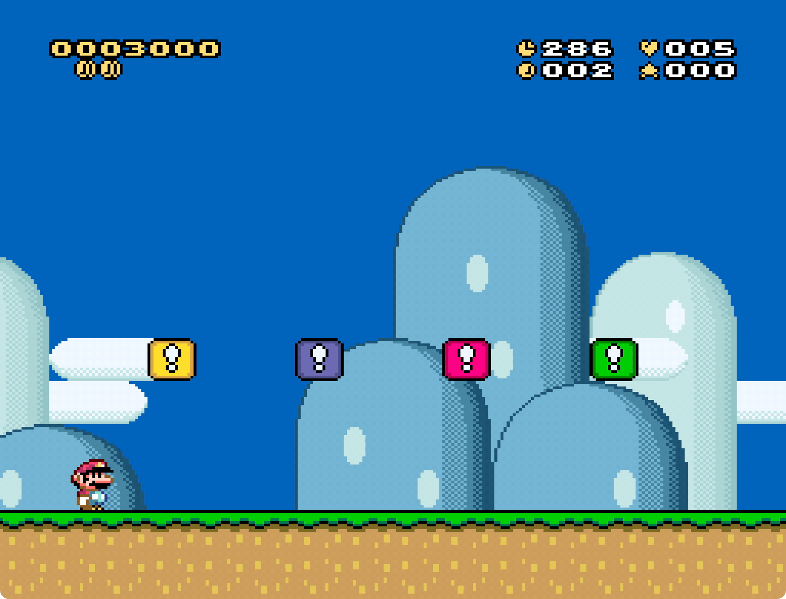

# Custom Status Bar

Custom Status Bar (CSB) is a UberASM that allows you to configure SMW's status
bar in different ways.

| [Download v0.1.0](https://github.com/zuccha/smw-code/releases/download/custom_status_bar%2F0.1.0/custom_status_bar-0.1.0.zip) |
| :---------------------------------------------------------------------------------------------------------------------------: |

|  |
| ------------------------------------------------------------- |

If you don't know how it works and want to find out more, check out the list of
[features](./docs/markdown/features.md).

## Contents

1. [Features](./docs/markdown/features.md)
2. [Dynamic positioning](./docs/markdown/dynamic_positioning.md)
3. [How to insert](./docs/markdown/how_to_insert.md)
4. [How to use](./docs/markdown/how_to_use.md)
5. [How to remove](./docs/markdown/how_to_remove.md)
6. [Compatibility](./docs/markdown/compatibility.md)
7. [Credits](./docs/markdown/credits.md)
8. [Changelog](./docs/markdown/changelog.md)
