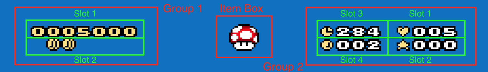

# Dynamic positioning

Dynamic positioning is when elements "shift" from one position to the next one
filling holes

|  |
| :-------------------------------------------------------------------------------------------------: |
|                  In the sublevel coins are not visible and time takes their place                   |

But how does it work?

Status bar elements are organized in clusters:

- Group 1: Bonus Stars, Coins, Lives, and Time
- Group 2: Dragon Coins and Score
- Item Box

|  |
| :--------------------------------------: |
|           All groups and slots           |

Every group controls its set of elements to display in positions called "slots".
Elements within a group are ordered by priority via settings. For instance

```asm
!group_1_order = !lives, !bonus_stars, !time, !coins
```

By configuration, in group 1 the lives indicator has the highest priority, and
the coins the lowest. But what does this mean?

Visible elements will be positioned in slots in increasing order. In the example
above, the life counter is the first element, so it is drawn in slot 1, bonus
stars are drawn in slot 2, and so on. This is useful because if some element is
not visible, those that follow will shift to take its place, so to avoid holes
in your status bar.

Let's suppose we configured the time indicator to appear only if the time limit
is greater than zero. Then we have different positions for the coin indicator if
we have all elements

|  |
| :-----------------------------------------------------: |
|                  All elements visible                   |

or if the timer is missing

|  |
| :----------------------------------------------------------------------------------: |
|                  No timer, coin indicator shifts to take its place                   |

The same applies for score and dragon coins. If the score is not visible, dragon
coins will shift to the top line of the status bar.

By default the slots of each group are drawn close to each other, but you can
actually place each slot wherever you want in the space available to the status
bar.
