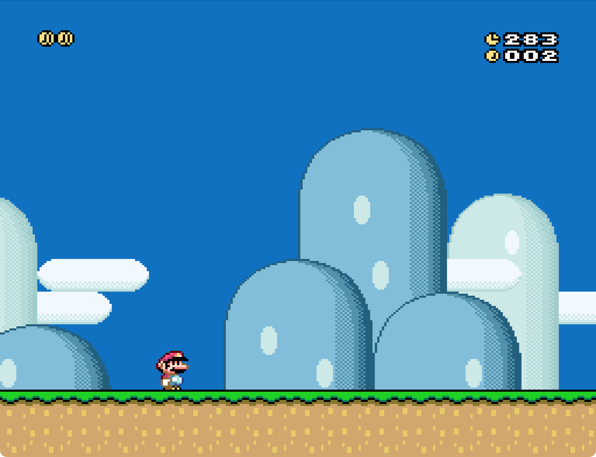
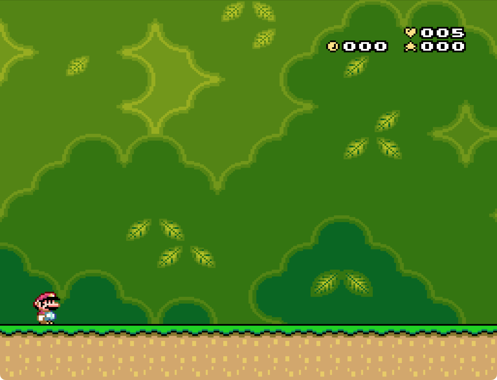
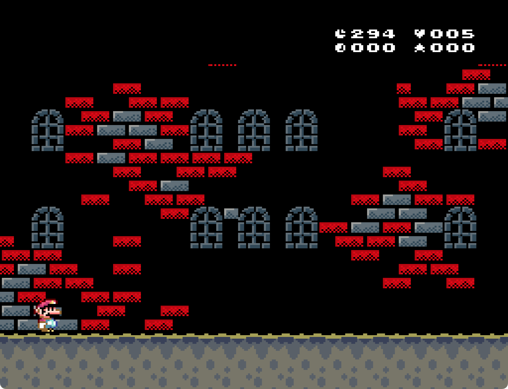
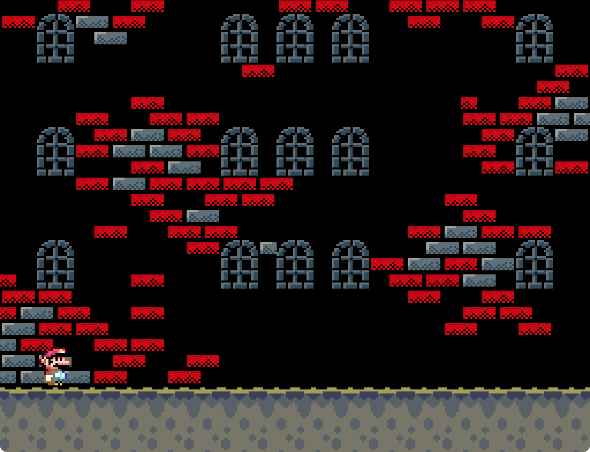
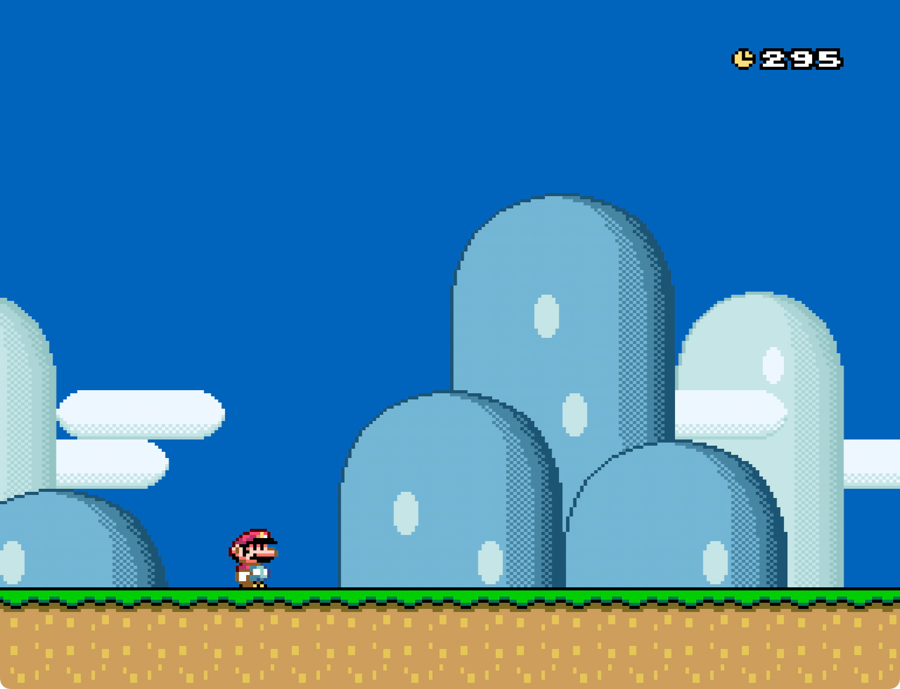
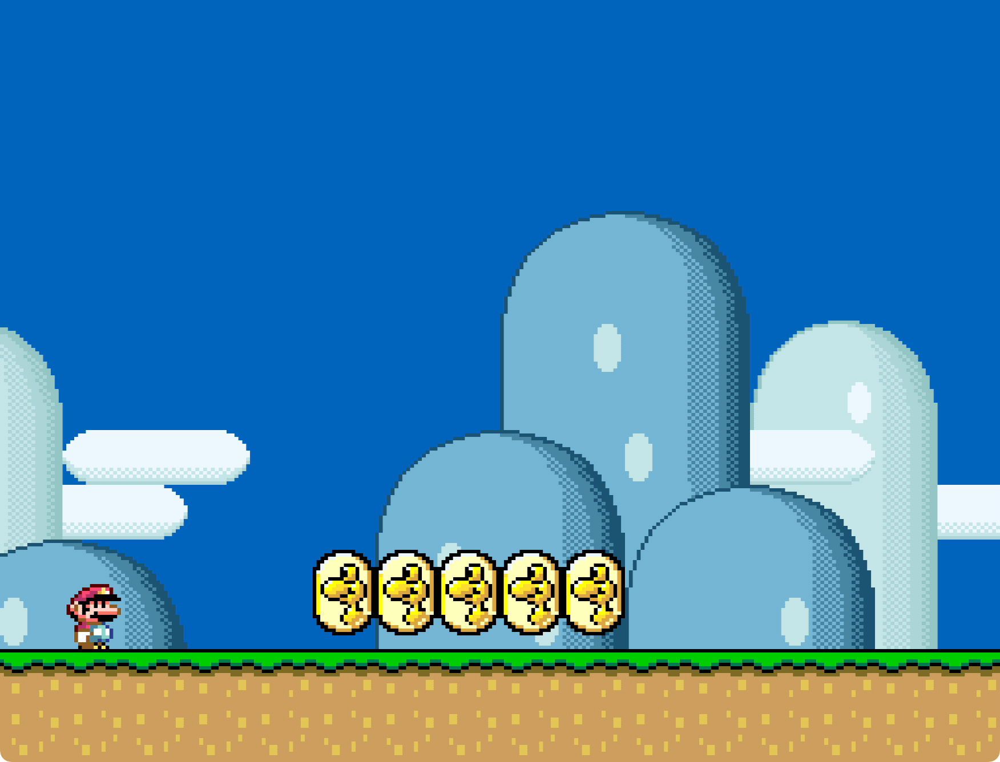

# Features

List of features available with Custom Status Bar (CSB).

Note that everything that is show in this overview can be achieved by a series
of different customizations, however by default CSB retains the original
behaviors whenever possible (except for the graphics).

## Table of Contents

1. [Original elements in a minimalistic style](#original-elements-in-a-minimalistic-style)
2. [Control elements visibility](#control-elements-visibility)
3. [Per-level customization](#per-level-customization)
4. [Dynamic elements positioning](#dynamic-elements-positioning)
5. [RAM-controlled settings](#ram-controlled-settings)
6. [Disable IRQ and free layer 3](#disable-irq-and-free-layer-3)
7. [Altering limits and their behaviors](#altering-limits-and-their-behaviors)
8. [Change timer frequency](#change-timer-frequency)
9. [Custom dragon coins messages and symbols](#custom-dragon-coins-messages-and-symbols)
10. [Disable the item box](#disable-the-item-box)

## Original elements in a minimalistic style

All of the original elements of the status bar (bonus stars, coins, dragon
coins, item box, lives, score, and time) are still available, but are presented
in a more minimalistic style.

|  |
| :-------------------------------------------------------------: |
|                  Same status bar, less clutter                  |

You can reorganize elements as you like

|  |
| :------------------------------------------------------------: |
|             Elements positions have been mirrored              |

And use custom symbols before bonus stars, coins, lives, and time

|  |
| :------------------------------------------------------------------: |
|                     Elements with custom symbols                     |

Notice that the newly designed status bar makes use of a couple of graphics that
are not present in the original _GFX28_ (e.g., the heart before the lives
counter). This is because this UberASM comes with a modified _GFX28_ that you
can import in your hack. Usage is completely **optional** and it's not the
default. In this guide we will use images that make use of it.

## Control elements visibility

Any element in the status bar can be easily made visible or hidden

|  |
| :------------------------------------------------------------------------------------: |
|                          No score, lives or bonus stars here                           |

By default, when an element is hidden it will also be disable (e.g., coins will
not be increased, time doesn't run out, etc.). If you want, you can make
elements active even if they are not visible

|  |
| :-------------------------------------------------------------------------------: |
|                  The time runs out even if no time is displayed                   |

You can also set the time to be displayed only if the limit specified in Lunar
Magic is greater than zero

|  |
| :------------------------------------------------------------------------------------------: |
|                    The sublevel has no time limit, so the time disappears                    |

## Per-level customization

You can have different configurations of the status bar depending on the level.
A global configuration defines the base behavior of the status bar, but almost
any setting can be overridden on a level basis

|  |
| :-------------------------------------------------------------------------: |
|                 In the sublevel there is no coin indicator                  |

## Dynamic elements positioning

Don't you hate when you have a hole in the UI?

|  |
| :-----------------------------------------------------------------------------------: |
|                  There is a hole where the coin indicator should be                   |

Don't worry, this won't actually happen with CSB ;). In fact, this UberASM
"shifts" elements when one is not visible

|  |
| :-------------------------------------------------------------------------------------------------: |
|                  In the sublevel coins are not visible and time takes their place                   |

To understand how it works, check out the guide
[about dynamic positioning](./about_dynamic_positioning.md).

## RAM-controlled settings

Almost every setting has an equivalent address in memory. The RAM addresses are
available in UberASMCode, but they can also be imported in other tools, like
GPS. This means that it is possible to control the behavior of the status bar at
runtime, via custom blocks for example

|  |
| :-----------------------------------------------------------------------------------------: |
|                      A block that toggles the status bar's visibility!                      |

Technical comment: this is also how you control the status bar on a level basis.

## Disable IRQ and free layer 3

If you don't really need the status bar in a level (or in most levels), the you
can completely turning it off. The difference compared to turning off elements
individually is that IRQ is disabled and layer 3 is entirely free!

|  |  |
| :-----------------------------------------------: | :------------------------------------------------: |
|                Status bar enabled                 |                Status bar disabled                 |

Notice how the background that is on layer 3 leaves a hole when the status bar
is enabled.

Credits to KevinM for this, code was taken from his
[RAM Toggled Status Bar (& IRQ)](https://www.smwcentral.net/?p=section&a=details&id=28449)
patch.

## Altering limits and their behaviors

You can customize the maximum amount of bonus stars and coins a player can get
during a level

|  |  |
| :-------------------------------------------------: | :--------------------------------------------: |
|                  Max 5 bonus stars                  |                  Max 10 coins                  |

Altering a limit will change when specific limit-events are triggered (e.g.,
receiving an extra life when collecting enough coins).

It is possible to prevent the game from resetting these limits when reached

|  |  |
| :---------------------------------------------------: | :---------------------------------------------: |
|                  No more bonus stars                  |                  No more coins                  |

You can also disable some vanilla behaviors that happen when different limits
are reached. In particular:

- Disable going to bonus game when bonus stars limit is reached
- Disable getting a life when coins limit is reached
- Disable player dying when time runs out

|  |  |  |
| :---------------------------------------------: | :---------------------------------------------: | :----------------------------------------: |
|                  No bonus game                  |                  No extra life                  |                  No death                  |

In addition to that, you can also define custom behaviors on these events. For
instance, we could disable the status bar once we collect 10 coins

|  |
| :-----------------------------------------------: |
|                  Bye status bar!                  |

## Change timer frequency

Ever wished to have the timer count _actual_ seconds? Well wish no more, for
this is now a reality

|  |
| :----------------------------------------------: |
|                 Seconds goin by                  |

## Custom dragon coins messages and symbols

In the original game, dragon coins appear in the status bar as you collect them,
and disappear once you collected them all. While this behavior is still the
default, you can make it so that dragon coins don't ever disappear

|  |  |
| :----------------------------------------------: | :---------------------------------------------: |
|                     Original                     |                     Altered                     |

Even better, you can show a custom message when all dragon coins are collected

|  |
| :-----------------------------------------------------------------: |
|                     Custom dragon coins message                     |

Finally, you can show different graphics for collected and missing dragon coins

|  |
| :----------------------------------------------------------------------: |
|                     Xs for collected, Os for missing                     |

## Disable the item box

By default the item box that drops a stored power up is visible and working, but
you can also make it so that it is invisible and not working, and invisible and
working

|  |  |
| :--------------------------------------------------------: | :-------------------------------------------------------: |
|                   Invisible and disabled                   |                   Invisible and enabled                   |
