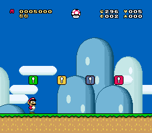

# Custom Status Bar

Custom Status Bar (CSB) is a UberASM that allows you to configure SMW's status
bar in different ways.

|  |
| ------------------------------------------------------------- |

If you don't know how it works and want to find out more, check out the list of
[features](./docs/markdown/features.md).

## Contents

1. [Features](./docs/markdown/features.md)
2. [Dynamic positioning](./docs/markdown/dynamic_positioning.md)
3. [How to insert](./docs/markdown/how_to_insert.md)
4. [How to use](./docs/markdown/how_to_use.md)
5. [How to remove](./docs/markdown/how_to_remove.md)
6. [Known issues](./docs/markdown/known_issues.md)
7. [Compatibility](./docs/markdown/compatibility.md)
8. [Credits](./docs/markdown/credits.md)
9. [Changelog](./CHANGELOG.md)

Phases:

- Merge m 1 00000001
- Tag t 2 00000010
- Archive a 4 00000100
- Release r 8 00001000
- Discord d 16 00010000
- Summary s 32 00100000

Documentation:

- Markdown
- HTML
- Text
- Images

Git:

- Commit to tag
