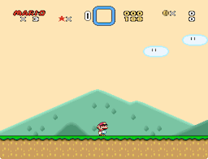

# Kill Player on Button Press

Author: zuccha, requested by The_Uber_Camper.

UberASM that kills the player after a button of your choosing has been pressed a
given amount of times.



## Contents

This bundle contains the following files:

- `UberASMTool/level/kill_player_on_button_press.asm`: The code specific for the
  level. This will take care of updating the counter and display an indicator in
  the status bar or as a sprite.
- `ExGraphics/Indicator (SP3).bin`: Graphics file that contains the digits to be
  used for the indicator sprite.

## Usage

Here follow the instructions on how to use, display, and configure this UberASM.

### Basic usage

First, you need to copy "UberASMTool/level/kill_player_on_button_press.asm" file
inside UberASMTool's "level" folder.

Open the copied file, and change the settings. In the file you can choose which
button presses to detect, how many presses are needed to kill Mario, and how to
display an indicator. Everything is documented in the file.

Open UberASMTool's "list.txt" and add the following under the `level:` label:

```uberasm
105 kill_player_on_button_press.asm
```

Obviously, use the level you actually want to insert the code into.

Run UberASMTool, and it should work.

### Show the counter over Mario's head

Note that this step is optional, you need to do this only if you want the
counter to be visible over Mario's head.

Enable the sprite indicator via the `!sprite_visibility` define. For this to
display the numbers correctly, you also need to insert the included
`ExGraphics/Indicator (SP3).bin` in Lunar Magic, or any graphics file containing
the digits 0-9. In case of a custom ExGFX file, you can set the position of the
digits tiles with the `sprite_tiles` table. You can choose which SP slot to use
with `!sprite_sp` (the default is SP3).

The sprite will follow Mario whenever he goes. You can choose to show the inputs
done or the inputs remaining via the extra bit.

### Show the counter in the status bar

Note that this step is optional, you need to do this only if you want the
counter to be visible in the status bar.

Enable the sprite indicator via the `!statusbar_visibility` define.

### Free RAM

This UberASM uses one byte of free RAM to keep track of how many times the
player has pressed the button.

By default, they are defined as follows:

```asar
!ram_button_presses_count = $140B|!addr
```

## Compatibility

This UberASM is compatible with SA-1.
