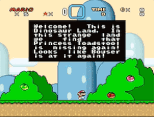
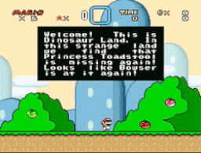

# Update Player Overworld Animation

**Authors:** zuccha, Kevin

Thanks to Kevin for fixing the problem where the animation was not correctly set
on the first frame after load.

Credits are optional.

## Description

When loading the overworld (after game over, clearing level, loading save file,
etc.), by default the game doesn't check and update Mario/Luigi's animation (it
will use whatever value was previously stored or, in case of a new game, it will
use the walk animation). This is most noticeable if you put Mario on a water
level as your starting position on the overworld, resulting on Mario having the
walk animation instead of the swim animation. This UberASM checks on which tile
Mario/Luigi is standing when loading the overworld: if it is a water level tile
it sets the player animation to swim, otherwise to walk.

|         |        |
| :------------------------------: | :-----------------------------: |
| ❌ Mario stands on a water level | ✅ Mario swims on a water level |

This should also help in the rare case if you move Mario's position on the
overworld from within a level, and it changes position from a ground level to a
water level or vice-versa.

## Known Issues

This routine only updates the CURRENT player (`$0DD6`) and neglets the other,
because we don't have an equivalent of $13C1 (current player tile on the
overworld) for the non-active player. This means that in two-players mode, if
the game starts with Mario and Luigi both on water level tiles, Luigi's
animation won't be updated until the player enters a level with Luigi and then
exits. This happen because on the first overworld load, the current player is
Mario, so Luigi's animation is not updated. When Mario dies, the overworld still
loads with Mario as current player, and a fade animation transfers the control
to Luigi, but it's too late since we are not longer in game mode 2D, so we need
to enter a level and exit as Luigi to update the animation.

A way to fix this problem would be not relying on addess `$13C1`, instead
compute the tiles for both players based on their X and Y position on the
overworld and always fix the animation for both of them. However, due to my
limited ASM knowledge, I was not able to figure out how/where exactly `$13C1` is
computed in the original code to replicate it here. Maybe I'll fix it in the
future.

## Changelog

### [1.0.1] - 2023-07-02

#### Fix

- Ensure correct animation is used during first frame after load

### [1.0.0] - 2023-06-24

Initial Release

## Usage

Put this file in the "gamemode" folder of UberASMTool, and the following line
under the _gamemode_ label in UberASMTool's `list.txt`:

```
0D update_player_overworld_animation.asm
```

If you are already using another file for game mode 0D (such as the Retry's
`retry_gm0D.asm` to show the death counter), you can create a new file called
`gm0D.asm` in the `gamemode` folder with the following contents:

```asm
macro call_library(i)
PHB
LDA.b #<i>>>16
PHA
PLB
JSL <i>
PLB
endmacro

init:
%call_library(retry_gm0D_init)
%call_library(update_player_overworld_animation_init)
RTL
```

and set the following line in `list.txt` under the _gamemode_ label:

```
0D gm0D.asm
```

For more, check out UberASMTool's
[FAQ](https://www.smwcentral.net/?p=faq&page=1515827-uberasm) on SMWCentral.
